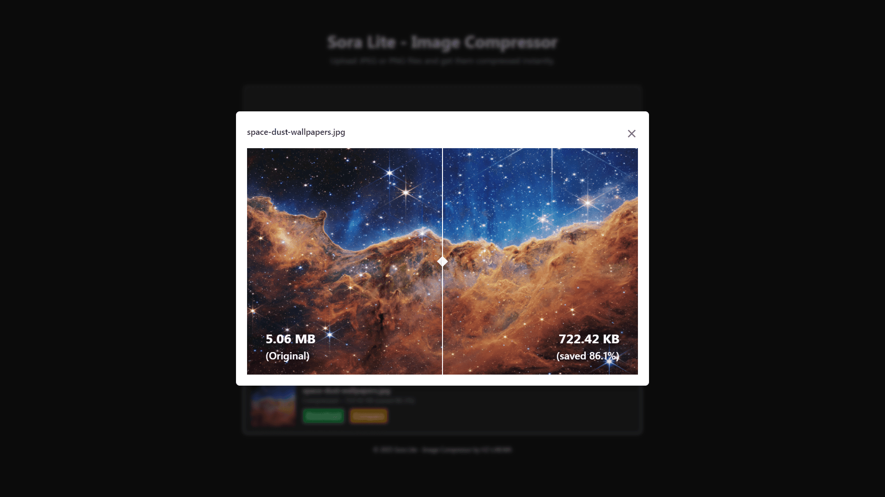

# Sora Lite : Image‑Compress‑WebApp

A tiny, production‑ready image‑compression service (inspired by Squoosh.app) that
processes JPEGs with **mozjpeg** and PNGs with **pngquant** on the server side.

## Features

- Drag‑and‑drop / multi‑file selector (max 20 files, ≤ 100 MiB total)
- Server‑side compression  
  * JPEG – quality 75, progressive, chroma subsampling 4:2:0  
  * PNG – quality [0.6, 0.8]
- Concurrency limit of 6 files while processing
- Individual download links **or** a single ZIP archive for all files
- Automatic cleanup of temporary files after 5 minutes
- Responsive UI built with Tailwind CSS
- Basic security headers (Helmet) and request logging (Winston)



## Prerequisites

- **Node.js** ≥ 18 (LTS)
- **npm** (bundled with Node)


## Installation

```bash
git clone https://github.com/zerocoldprod/sora-lite
cd sora-lite
npm install
```

## Usage

```bash
npm start
```

This will start the server on `http://localhost:7841` and `https://localhost:7840`. 
You can access the UI by navigating to `http://localhost:7841` in your web browser.

## Configuration


```javascript
const PORT = process.env.PORT || 7841;
const PORT_SSL = process.env.PORT_SSL || 7840; // separate env var for clarity
const CLEANUP_ENABLED = true;
const CLEANUP_AFTER_MS = 5 * 60 * 1000; // 5 minutes
const MAX_TOTAL_SIZE = 100 * 1024 * 1024; // 100 MiB
const MAX_FILES = 20;
```